# AI Agent Backend - Full Architectural Plan (DevFusion Enhanced)

**Version:** 0.2
**Date:** May 29, 2025
**Primary Goal:** To design a highly modular, asynchronous, and intelligent AI agent backend capable of advanced deep research, senior-level full-stack web application development, and flexible tool usage, with robust learning mechanisms and comprehensive observability.

## 1. Guiding Principles

* **Modularity & Decoupling:** Components are independently developable, deployable, and replaceable, communicating via well-defined interfaces and messages.
* **Asynchronicity & Responsiveness:** The entire system operates asynchronously to handle long-running tasks efficiently, maintain UI responsiveness, and enable parallel processing.
* **Extensibility & Adaptability:** Easily integrate new LLMs, tools, data sources, and agent capabilities with minimal disruption.
* **Intelligence & Learning:** The system should not only execute tasks but also learn from interactions, feedback, and outcomes to improve future performance.
* **Clarity & Learnability:** The architecture and code must be understandable, well-documented, and maintainable.
* **User Interaction & Transparency:** Provide a rich user interface for clear insight into the agent's thought process, state, and for facilitating user guidance and feedback.
* **Robustness & Resilience:** Design for fault tolerance, error handling, retries, and graceful degradation.
* **Scalability:** The architecture supports scaling individual components to meet demand.
* **Security & Governance:** Implement security best practices throughout the system and provide mechanisms for governance and ethical considerations.
* **Observability:** Comprehensive logging, metrics, and tracing to monitor system health and performance.

---
## 2. Overall System Diagram (Conceptual - Asynchronous & Enhanced)

```mermaid
graph TD
    %% User Facing Block
    subgraph "User Interface Layer"
        direction LR
        UI_FE["User Interface (Web Frontend)"]
        UI_BE["UI Backend / API Gateway (Async, WebSockets)"]
    end

    %% Agent Core & Orchestration Block
    subgraph "Agent Core (Asynchronous)"
        Orchestrator["Task Orchestrator (Manages Task Lifecycles & Sagas)"]
        CapabilitiesEngine["Agent Capabilities Engine (Planning, Reasoning, Learning)"]
        ContextManager["Context Manager Service"]
    end

    %% Communication Core
    subgraph "Communication Backbone"
        MB["Message Broker (e.g., RabbitMQ, Kafka)"]
    end

    %% Data & Knowledge Block
    subgraph "Data & Knowledge Layer"
        DB_Interface["Operational DB Interface (Async)"]
        VectorDB_Interface["Vector DB / Knowledge Base Interface (Async)"]
        KB_Updater["Knowledge Base Updater (Async Worker)"]
    end

    %% Modules & Tools Block (Asynchronous Workers)
    subgraph "Asynchronous Tool Modules & Services"
        direction TB
        LLM_Abs["LLM Abstraction Layer (Async)"]
        Tool_Coding["Tool: Coding Playground (Async Worker)"]
        Tool_Internet["Tool: Internet Access (Async Worker)"]
        Tool_GitHub["Tool: GitHub Integration (Async Worker)"]
        Tool_Research["Tool: Deep Research Module (Async Composite Worker)"]
        FeedbackCollector["Feedback Collector Service (Async Worker)"]
    end

    %% External Services Block
    subgraph "External Dependencies"
        direction TB
        Ollama{{"Ollama LLM"}}
        OtherLLMs{{"Other LLMs (OpenAI, Anthropic, etc.)"}}
        GitHub_Service{{"GitHub Service"}}
        OperationalDB[("DB: PostgreSQL/MongoDB")]
        VectorDB[("Vector DB: Pinecone, Weaviate, Chroma")]
    end

    %% Monitoring & Config
    subgraph "System Support Services"
        Monitoring["Observability Platform (Logging, Metrics, Tracing)"]
        ConfigMgrService["Configuration Manager Service"]
    end

    %% Core User Interaction Flow
    UI_FE -- HTTP/S API Calls --> UI_BE
    UI_FE -- WebSocket --> UI_BE

    %% Task Submission & Real-time UI Updates
    UI_BE -- Publishes New Task --> MB
    MB -- Consumes Task --> Orchestrator
    Orchestrator -- Interacts --> CapabilitiesEngine
    CapabilitiesEngine -- Publishes UI Updates/Thoughts --> MB
    MB -- Streams Updates/Questions --> UI_BE

    %% Orchestrator/Capabilities Engine to Tool Interaction
    CapabilitiesEngine -- Publishes Tool Task --> MB
    MB -- Consumes Tool Task --> LLM_Abs
    MB -- Consumes Tool Task --> Tool_Coding
    MB -- Consumes Tool Task --> Tool_Internet
    MB -- Consumes Tool Task --> Tool_GitHub
    MB -- Consumes Tool Task --> Tool_Research

    %% Tool to Orchestrator/Capabilities Engine Interaction
    LLM_Abs -- Publishes Result --> MB
    Tool_Coding -- Publishes Result --> MB
    Tool_Internet -- Publishes Result --> MB
    Tool_GitHub -- Publishes Result --> MB
    Tool_Research -- Publishes Result --> MB
    MB -- Consumes Result --> CapabilitiesEngine
    CapabilitiesEngine -- Notifies --> Orchestrator

    %% Data Interactions
    Orchestrator <--> DB_Interface
    CapabilitiesEngine <--> DB_Interface
    CapabilitiesEngine <--> VectorDB_Interface
    ContextManager <--> DB_Interface
    ContextManager <--> VectorDB_Interface
    Tool_Research -- Uses --> VectorDB_Interface
    KB_Updater -- Updates --> VectorDB_Interface
    FeedbackCollector -- Publishes to --> MB
    MB -- Consumes Feedback --> KB_Updater


    %% LLM Abstraction
    LLM_Abs -- Async HTTP --> Ollama
    LLM_Abs -- Async HTTP --> OtherLLMs

    %% External Tools
    Tool_GitHub -- API Calls --> GitHub_Service

    %% Configuration & Monitoring
    Orchestrator -- Uses --> ConfigMgrService
    CapabilitiesEngine -- Uses --> ConfigMgrService
    LLM_Abs -- Uses --> ConfigMgrService
    %% (all other services use ConfigMgrService)
    %% (all services publish to Monitoring)

    %% Context Flow
    CapabilitiesEngine -- Requests/Updates Context --> ContextManager
```



---
## 3. Component Breakdown (Asynchronous Architecture)

### 3.1. Task Orchestrator (Agent Workflow Manager)

* **Purpose:** Manages the lifecycle of complex tasks, ensuring reliable execution through potentially long-running, multi-step processes. Focuses on workflow mechanics rather than deep reasoning.
* **Key Responsibilities:**
    * Consumes initial user tasks from the `UI Backend` via the `Message Broker`.
    * Initiates tasks with the `Agent Capabilities Engine` for planning and execution.
    * **Saga Pattern Implementation:** Manages distributed transactions and long-running processes, handling compensation logic for failures in a series of steps.
    * **State Management:** Persistently tracks the high-level state of tasks (e.g., `RECEIVED`, `PLANNING`, `EXECUTING_STEP_N`, `AWAITING_USER_INPUT`, `COMPLETED`, `FAILED`, `COMPENSATING`) in the `Operational DB` via `DB_Interface`.
    * Coordinates with `Context Manager` to ensure task context is established.
    * Handles overarching error conditions and escalations if the `Capabilities Engine` cannot resolve them.
    * Publishes high-level task status updates to the `Message Broker` for UI consumption.
* **Interfaces/APIs:**
    * Consumes tasks from `UI Backend` via `Message Broker`.
    * Communicates with `Agent Capabilities Engine` (likely via internal messaging or direct async calls if co-located conceptually).
    * Interacts with `DB_Interface`.
* **Technologies:** Python with `asyncio`, libraries for `Message Broker`.
* **Key Data Structures:**
    * `TaskRecord`: (Persisted) Overall goal, `task_id`, user, timestamps, high-level status, references to `AgentExecutionPlan`.

### 3.2. Agent Capabilities Engine (Agent Brain & Planner)

* **Purpose:** The core intelligence of the agent. Responsible for understanding tasks, planning, reasoning, learning, and invoking tools to achieve goals.
* **Key Responsibilities:**
    * Receives tasks from the `Orchestrator`.
    * **Task Decomposition & Planning:** Breaks down complex goals into detailed, executable step-by-step plans using LLMs and potentially other planning algorithms. Stores this plan (`AgentExecutionPlan`).
    * **Tool Selection & Invocation:** Dynamically selects appropriate tools (`LLM Abstraction Layer`, `Coding Playground`, etc.) for each step in the plan. Publishes tool task messages to the `MessageBroker`.
    * **Result Consumption & Analysis:** Consumes results from tools via `Message Broker`. Analyzes results, updates the plan, and decides on next steps.
    * **Contextual Reasoning:** Works closely with the `Context Manager` to retrieve and update context for decision-making.
    * **Problem Solving & Adaptation:** Implements strategies to handle unexpected tool outputs, errors, or changing requirements. May re-plan or request user clarification.
    * **User Interaction Coordination:** Signals to `Orchestrator` when user input is needed; processes user responses.
    * **Learning Loop Integration:** Utilizes insights from the `Knowledge Base Updater` (e.g., RAG via `VectorDB_Interface`) and `FeedbackCollector` to refine planning and execution strategies.
    * Publishes detailed "thought process" logs, current step, and status updates to the `Message Broker`.
* **Interfaces/APIs:**
    * Interacts with `Orchestrator`.
    * Publishes task messages to tool queues on `Message Broker`.
    * Subscribes to result queues from tools.
    * Interacts with `DB_Interface` (for execution plans) and `VectorDB_Interface` (for RAG).
    * Interacts with `Context Manager Service`.
* **Technologies:** Python with `asyncio`, advanced LLM interaction libraries, potential for planning libraries.
* **Key Data Structures:**
    * `AgentExecutionPlan`: (Persisted) Detailed steps, tool assignments, parameters, status of each step, intermediate results.
    * `PromptTemplates`: For various reasoning tasks.

### 3.3. Context Manager Service

* **Purpose:** Manage and provide access to the relevant context for ongoing tasks. This is crucial for enabling "senior-level" capabilities, as complex tasks require understanding extensive history and data.
* **Key Responsibilities:**
    * Maintain short-term (active task memory) and long-term (project-specific knowledge, user preferences) context.
    * Assemble context packages for the `Agent Capabilities Engine` and `LLM Abstraction Layer` based on `task_id` and current step.
    * Store and retrieve conversational history, code snippets, research findings, and other relevant data snippets.
    * Interface with `Operational DB` for structured context and `VectorDB` for semantic search over unstructured context.
    * Manage context window limitations for LLMs (e.g., summarization, chunking strategies).
* **Interfaces/APIs:** Asynchronous internal Python functions (e.g., `async def get_context(task_id, scope)`).
* **Technologies:** Python with `asyncio`, interfaces to `Operational DB` and `VectorDB`.

### 3.4. LLM Abstraction Layer (Enhanced)

* **Purpose:** Provide a consistent, enhanced asynchronous interface for interacting with various LLMs, including managing model-specific capabilities and limitations.
* **Key Responsibilities:**
    * Asynchronous worker consuming requests from `Message Broker`.
    * Abstracts LLM API details.
    * Handles authentication.
    * **Prompt Engineering & Formatting:** Adapts generic prompts from `Capabilities Engine` to model-specific optimal formats. Potentially includes prompt chaining or sub-queries for complex requests.
    * **Response Parsing & Standardization:** Parses LLM responses into a rich, standardized format, including confidence scores, alternative outputs (if available), and error details.
    * **Capability Mapping:** (Future) Understands which models are best for which types of sub-tasks (e.g., coding, summarization, creative writing).
    * Publishes results back to `Message Broker`.
* **Interfaces/APIs:**
    * Input: `LLMRequestMessage` (prompt, model prefs, `reply_to_topic`, `task_id`).
    * Output: `LLMResponseMessage` (content, metadata, errors, `correlation_id`).
* **Technologies:** Python, `asyncio`, `aiohttp`, specific LLM SDKs.
* **Key Data Structures (Messages):**
    * `LLMRequestMessage`: Enriched with more context hints.
    * `LLMResponseMessage`: Enriched with more metadata.

### 3.5. Tool Modules (Asynchronous Workers)

Each tool is a self-contained asynchronous worker with standardized message-based interfaces. They all publish detailed operational logs for observability.

#### 3.5.1. Tool: Coding Playground (Enhanced)

* **Purpose:** Secure, instrumented environment for code execution, debugging, and testing.
* **Key Responsibilities:**
    * Consumes `CodeExecutionRequest` from `Message Broker`.
    * **Environment Provisioning:** Sets up isolated environments (e.g., Docker containers with specified dependencies). `asyncio.subprocess` for container management.
    * Executes code, captures stdout/stderr, exit codes, performance metrics (CPU/memory usage).
    * **File System Access:** Provides a virtual, isolated file system for the code to operate on.
    * **Debugging Support:** (Future) Interface for step-through debugging if feasible.
    * Publishes `CodeExecutionResponse` (outputs, errors, metrics) to `Message Broker`.
* **Interfaces/APIs:** `CodeExecutionRequest`, `CodeExecutionResponse`.
* **Technologies:** Python, `asyncio`, `docker-py` (async-wrapped), `asyncio.subprocess`.

#### 3.5.2. Tool: Internet Access Module

* (Largely as previously defined)
* **Enhancement:** More robust error handling, retry mechanisms, and content parsing (e.g., extracting main content from HTML).

#### 3.5.3. Tool: Deep Research Module (Enhanced)

* **Purpose:** Conduct comprehensive, multi-source research, synthesize findings, and identify knowledge gaps.
* **Key Responsibilities:**
    * Consumes `ResearchRequest`.
    * **Internal Orchestration:**
        * Uses `LLM Abstraction Layer` for query generation, analysis, summarization.
        * Uses `Internet Access Module` for fetching articles, papers, data.
        * **Uses `VectorDB_Interface` to search existing knowledge and store new findings.**
        * Performs cross-referencing, identifies conflicting information, evaluates source reliability (rudimentary).
    * Compiles structured, citable reports.
    * Publishes `ResearchResponse` (report, sources, confidence levels).
* **Interfaces/APIs:** `ResearchRequest`, `ResearchResponse`.
* **Technologies:** Python, `asyncio`.

#### 3.5.4. Tool: GitHub Integration Module

* (Largely as previously defined)
* **Enhancement:** Support for more complex operations like branch management, PR creation/review (commenting), and issue tracking.

### 3.6. Communication Bus / Message Broker

* (As previously defined - RabbitMQ, Kafka, or Redis Streams)
* **Emphasis:** Well-defined exchanges, queues, and clear routing rules. Dead-letter queues (DLQs) for unprocessable messages.

### 3.7. Data & Knowledge Layer

#### 3.7.1. Operational Database Interface

* **Purpose:** Store transactional and state data for agent operations.
* **Responsibilities:** Asynchronous CRUD for task records, execution plans, user profiles, configurations (if not solely file-based), context snapshots.
* **Technologies:** `asyncpg` for PostgreSQL, `Motor` for MongoDB.

#### 3.7.2. Vector Database / Knowledge Base Interface

* **Purpose:** Store and retrieve information based on semantic similarity, enabling Retrieval Augmented Generation (RAG) and long-term memory.
* **Responsibilities:**
    * Asynchronous CRUD operations for vectorized data (text chunks, code snippets, research findings).
    * Provide efficient semantic search capabilities.
    * Store metadata associated with vectors.
* **Interfaces/APIs:** Asynchronous functions (e.g., `async def add_document(doc, vector)`, `async def search_similar(query_vector, top_k)`).
* **Technologies:** Python with `asyncio`, clients for Vector DBs (e.g., Pinecone, Weaviate, ChromaDB, FAISS).

#### 3.7.3. Knowledge Base Updater (Async Worker)

* **Purpose:** Process information from various sources (completed tasks, feedback, ingested documents) and update the `VectorDB`/`Knowledge Base`.
* **Key Responsibilities:**
    * Consumes messages from a dedicated topic (e.g., `new_knowledge_to_embed`).
    * Cleans, chunks, and generates embeddings for text/code using the `LLM Abstraction Layer` (or dedicated embedding models).
    * Stores embeddings and source data in the `VectorDB`.
    * Potentially re-processes or refines existing knowledge based on new insights or feedback.
* **Interfaces/APIs:** Consumes messages from `Message Broker`. Interacts with `VectorDB_Interface` and `LLM Abstraction Layer`.

### 3.8. User Interface (UI) Architecture

(Largely as previously defined, with FastAPI backend and modern web frontend)
* **Enhancements for UI Backend:**
    * More robust WebSocket connection management and error handling.
    * Clearer API contracts for frontend interaction.
    * Rate limiting and security hardening.
    * Interface for submitting structured feedback on agent performance.

### 3.9. Configuration Manager Service

* **Purpose:** Centralized and dynamic configuration management for all services.
* **Key Responsibilities:**
    * Load configs from files, environment variables, or a dedicated config store (e.g., HashiCorp Consul, AWS Parameter Store).
    * Provide an API or client library for services to fetch their configurations.
    * Support dynamic configuration updates where appropriate (with service reload/refresh mechanisms).
* **Technologies:** Python, `python-dotenv`, `PyYAML`, potentially a client for a config store.

### 3.10. Feedback Collector Service (Async Worker)

* **Purpose:** Collect explicit user feedback and implicit signals about task success/failure or quality of output.
* **Key Responsibilities:**
    * Consumes feedback messages from the `UI Backend` (e.g., ratings, corrections, 👍/👎 on steps) or other services.
    * Standardizes and stores feedback.
    * Publishes structured feedback to a topic on the `Message Broker` for consumption by the `Knowledge Base Updater` or a dedicated learning module.
* **Interfaces/APIs:** Consumes messages from `Message Broker`. Interacts with `DB_Interface` or a dedicated feedback store.

### 3.11. Observability Platform

* **Purpose:** Provide comprehensive monitoring, logging, and tracing across all distributed services.
* **Key Responsibilities:**
    * **Logging:** Aggregate structured logs from all services.
    * **Metrics:** Collect and display key performance indicators (KPIs) for each service (e.g., message queue lengths, processing times, error rates).
    * **Tracing:** Implement distributed tracing to follow requests as they flow through multiple services.
* **Technologies:** ELK Stack (Elasticsearch, Logstash, Kibana), Prometheus & Grafana, OpenTelemetry, Jaeger/Zipkin. Services will use client libraries to export data.

---
## 4. Data Flows (Example: Enhanced "Research topic X and outline blog post")

1.  **User Input (UI Frontend -> UI Backend):** User submits task. UI Backend sends `NewTask` to `Message Broker`.
2.  **Task Initiation (Message Broker -> Orchestrator -> Capabilities Engine):**
    * `Orchestrator` consumes `NewTask`, creates `TaskRecord` (status: `RECEIVED`), and forwards to `Agent Capabilities Engine`.
    * `Capabilities Engine` updates status to `PLANNING`. Publishes UI update.
3.  **Context Gathering (Capabilities Engine <-> Context Manager):** `Capabilities Engine` requests relevant existing context for "benefits of remote work" from `Context Manager`.
4.  **Planning (Capabilities Engine -> LLM Abstraction -> Capabilities Engine):**
    * `Capabilities Engine` sends `LLMRequest` (for planning) to `LLM Abstraction Layer`.
    * `LLM Abstraction Layer` gets plan from LLM, sends `LLMResponse` back.
    * `Capabilities Engine` consumes plan, stores it as `AgentExecutionPlan`.
5.  **Sub-task Execution - Research (Capabilities Engine -> Deep Research Module via MB):**
    * `Capabilities Engine` updates task status (`EXECUTING_RESEARCH`). Publishes UI update.
    * Publishes `ResearchRequest` message. `Deep Research Module` consumes.
    * `Deep Research Module` uses `LLM Abstraction`, `Internet Access`, and **`VectorDB_Interface`** for its work, publishing intermediate updates.
    * Publishes final `ResearchResponse`.
6.  **Knowledge Integration (Deep Research Module -> MB -> KB Updater -> VectorDB):** Research findings might also be published to a `new_knowledge_to_embed` topic, processed by `KB Updater`, and stored in `VectorDB`.
7.  **Sub-task Execution - Outline (Capabilities Engine -> LLM via MB):**
    * `Capabilities Engine` consumes research, updates status (`GENERATING_OUTLINE`). Publishes UI update.
    * Sends `LLMRequest` (with research, requesting outline) to `LLM Abstraction Layer`.
    * `LLM Abstraction Layer` processes, sends `LLMResponse` (outline).
8.  **Result & State Update (Capabilities Engine -> Orchestrator -> MB -> UI):**
    * `Capabilities Engine` receives outline, signals completion to `Orchestrator`.
    * `Orchestrator` updates `TaskRecord` to `COMPLETED` in DB.
    * `Orchestrator` (or `Capabilities Engine`) publishes `TaskCompleted` message with outline.
    * `UI Backend` relays to `UI Frontend`.
9.  **Feedback Loop (UI -> UI Backend -> MB -> Feedback Collector -> MB -> KB Updater):** User provides feedback on the outline. This flows through the `Feedback Collector` and can influence the `Knowledge Base`.

---
## 5. Modularity & Extensibility Strategy (Enhanced)

* **Standardized Message Schemas & Tool Contracts:** Clear, versioned schemas (JSON Schema, Avro, Protobuf) for all messages. Tools adhere to a defined "Tool Contract" specifying input/output messages and expected behaviors.
* **Service Discovery:** (Future) For dynamic scaling, integrate a service discovery mechanism (e.g., Consul, etcd).
* **Configuration-Driven Behavior:** Most aspects driven by the `Configuration Manager Service`.
* **Independent Microservices:** Each component (Orchestrator, Capabilities Engine, Tools, etc.) designed as a deployable microservice.

---
## 6. "Thinking" Process & UI Interaction Support (Enhanced)

* **Structured Event/Log Publishing:** `Capabilities Engine` and tools publish fine-grained, structured events (e.g., `PlanGenerated`, `StepInitiated`, `ToolInvoked`, `ClarificationNeeded`, `ResultAnalyzed`) to `Message Broker`.
* **Dynamic Contextual UI:** UI Backend subscribes and streams these to the UI, allowing for a very detailed, real-time view of the agent's reasoning.
* **Agent Pausing & User Input:**
    * `Capabilities Engine` identifies need for input, updates state via `Orchestrator` to `AWAITING_USER_INPUT`. Publishes `QuestionForUser` event.
    * User responds; `UI Backend` publishes `UserResponse`.
    * `Capabilities Engine` consumes response, `Orchestrator` updates state, processing resumes.

---
## 7. Development & Deployment (Enhanced)

* **Project Structure (Microservices Focus):**
    ```
    /DevFusion
        /config
           config.dev.yaml
        /services
            /task_orchestrator_service
            /capabilities_engine_service
            /context_manager_service
            /llm_abstraction_service
            /tool_coding_playground_service
            /tool_internet_access_service
            /tool_github_service
            /tool_research_service
            /feedback_collector_service
            /kb_updater_service
            /ui_backend_service
            /config_manager_service
        /shared
            /message_schemas
            /db_models
            /common_utils
        /observability
            /docker_configs_for_elk_prometheus_etc
        /docs
        /tests
            /integration
            /component
        docker-compose.yml
        requirements.txt
        .gitignore
    ```
* **Containerization & Orchestration:** Docker for each service. `docker-compose` for local dev. Kubernetes (or similar) for staging/production.
* **CI/CD:** Robust CI/CD pipelines for each service (testing, linting, security scanning, image building, deployment).
* **Infrastructure as Code (IaC):** Tools like Terraform or Pulumi to manage cloud infrastructure.

---
## 8. Security & Governance Strategy

* **Authentication & Authorization:**
    * User authentication at `UI Backend`.
    * Service-to-service authentication (e.g., mTLS, OAuth2 client credentials) for internal API calls and `Message Broker` connections.
    * Role-Based Access Control (RBAC) for accessing agent capabilities and data.
* **Data Security:**
    * Encryption in transit (TLS everywhere) and at rest (for databases, object storage).
    * Secure management of secrets (API keys, passwords) using tools like HashiCorp Vault or cloud provider KMS.
* **Code Execution Security:**
    * Strict sandboxing for `Coding Playground` (e.g., gVisor, Kata Containers, or Firecracker on top of Docker) with network policies and resource limits.
    * Regular vulnerability scanning of dependencies and container images.
* **Input Validation & Sanitization:** Rigorous validation of all inputs (user prompts, API calls, message content) to prevent injection attacks.
* **Ethical AI Guardrails:**
    * Mechanisms within the `Capabilities Engine` or `LLM Abstraction Layer` to detect and mitigate harmful content generation or biased outputs.
    * Audit trails for agent decisions and actions.
* **Rate Limiting & Throttling:** Protect services from abuse and ensure fair usage.
* **Compliance:** Design with relevant data privacy regulations (e.g., GDPR, CCPA) in mind if handling personal data.

---
## 9. Exporting This Architecture

* **File Format:** This Markdown format.
* **Diagrams:** Embedded Mermaid.js diagrams. Additional sequence diagrams for critical flows are recommended.